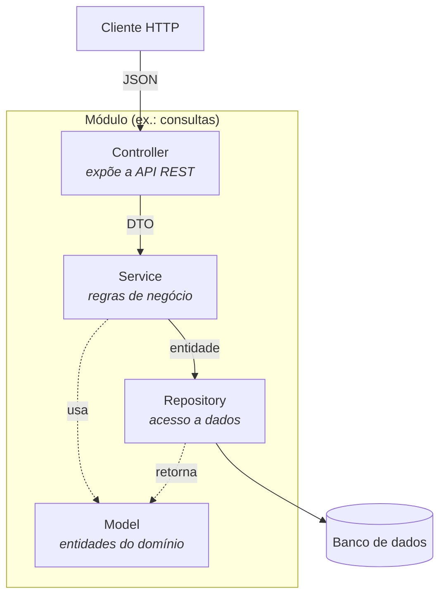
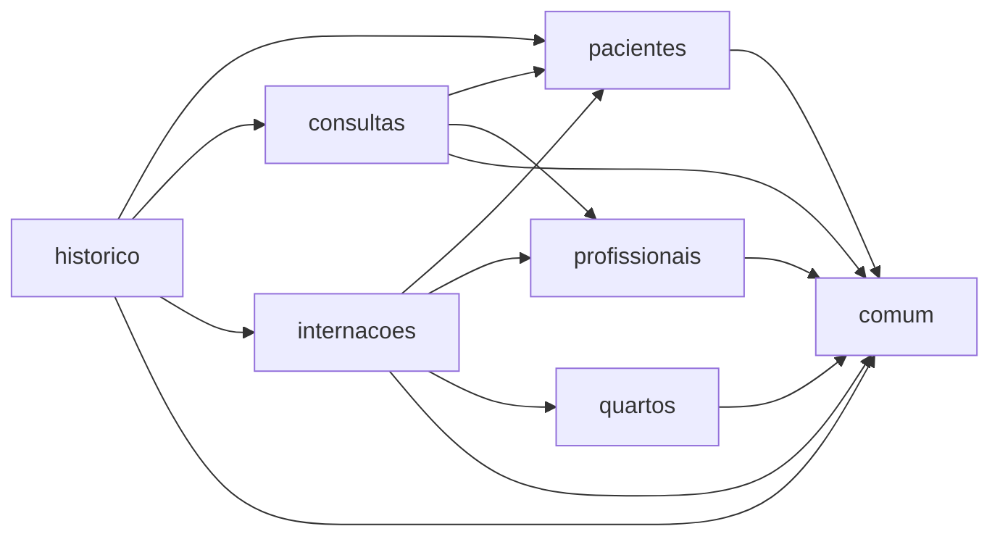
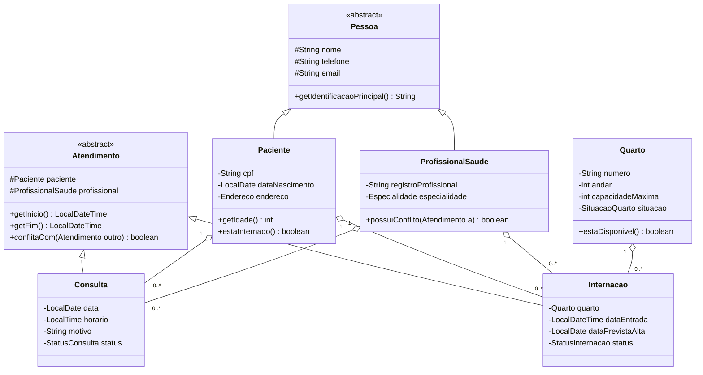

<div align="center">

# Vitalis

### Sistema de Informação Hospitalar

*Um hospital de médio porte trocando papel por software — modelado módulo a módulo.*

[](#-roadmap)
[](#-arquitetura)
[](#-sobre-o-projeto)
[](LICENSE)

</div>

---

## Índice

- [Sobre o projeto](#-sobre-o-projeto)
- [O problema](#-o-problema)
- [Arquitetura](#-arquitetura)
- [Os módulos](#-os-módulos)
- [Modelo de domínio](#-modelo-de-domínio)
- [Regras de negócio](#-regras-de-negócio)
- [Estrutura do repositório](#-estrutura-do-repositório)
- [Documentação](#-documentação)
- [Roadmap](#-roadmap)
- [Como contribuir](#-como-contribuir)
- [Equipe](#-equipe)

---

## 🏥 Sobre o projeto

**Vitalis** é o sistema de informação de um hospital de médio porte: cadastro de pacientes e profissionais, agendamento de consultas, controle de internações e ocupação de quartos, e o histórico médico que amarra tudo isso.

O projeto é o trabalho prático da disciplina **Programação Modular** do curso de Bacharelado em Engenharia de Software da **PUC Minas**. O foco não é entregar telas bonitas — é entregar um sistema cuja estrutura interna se sustente: módulos com fronteiras claras, responsabilidades que não vazam de uma camada para outra e regras de negócio que moram em um único lugar.

> **Este repositório está na fase de modelagem.** Ele contém a arquitetura, o modelo de domínio, as regras de negócio e a estrutura modular — ainda sem código de implementação. Cada pasta de módulo já existe com o contrato do que vai morar ali dentro.

---

## 🩺 O problema

Um hospital de médio porte mantém seus registros no papel. O resultado é previsível:

| Sintoma | Custo real |
|---|---|
| Prontuários em fichário | Ninguém acha o histórico do paciente na hora do atendimento |
| Agenda em caderno | Dois pacientes marcados com o mesmo médico no mesmo horário |
| Ocupação de quartos no quadro branco | Paciente internado em quarto que já estava cheio |
| Nenhum dado consolidado | A administração decide no achismo |

O Vitalis ataca cada um desses pontos com uma regra de negócio explícita e verificável — não com um campo de texto livre.

---

## 🏗 Arquitetura

O sistema é **modular por domínio** e, dentro de cada módulo, **estratificado em camadas**. Um módulo nunca alcança o banco de outro módulo: a conversa acontece pela camada de serviço.



**A regra de ouro:** cada camada só conhece a camada imediatamente abaixo.

| Camada | Faz | Nunca faz |
|---|---|---|
| **Controller** | Recebe a requisição, valida o formato, devolve o status HTTP | Regra de negócio, acesso ao banco |
| **Service** | Aplica as regras, orquestra, controla a transação | Saber que existe HTTP |
| **Repository** | Busca e grava dados | Decidir se a operação é permitida |
| **Model** | Guarda estado e comportamento do domínio | Conhecer framework ou banco |

Essa separação é o que permite trocar o banco de dados sem reescrever uma linha de regra de negócio — e testar as regras sem subir servidor nenhum.

---

## 🧩 Os módulos

Sete módulos, cada um dono de um pedaço do hospital.



| Módulo | Responsabilidade | Depende de |
|---|---|---|
| [`comum`](modulos/comum) | Exceções, respostas de erro, validações e tipos compartilhados | — |
| [`pacientes`](modulos/pacientes) | Cadastro de pacientes, endereço, dados de contato | `comum` |
| [`profissionais`](modulos/profissionais) | Cadastro de profissionais, especialidades e janelas de disponibilidade | `comum` |
| [`consultas`](modulos/consultas) | Agendamento, reagendamento, realização e cancelamento de consultas | `pacientes`, `profissionais` |
| [`internacoes`](modulos/internacoes) | Entrada, transferência e alta de pacientes internados | `pacientes`, `profissionais`, `quartos` |
| [`quartos`](modulos/quartos) | Leitos, andares, capacidade e situação de ocupação | `comum` |
| [`historico`](modulos/historico) | Consolidação do histórico médico do paciente | `pacientes`, `consultas`, `internacoes` |

**Sem dependência cíclica.** O grafo acima é acíclico por construção: se um módulo precisa "voltar", a lógica está no módulo errado.

---

## 📐 Modelo de domínio

Duas abstrações sustentam o modelo inteiro:



Por que `Atendimento` é abstrata? Porque a regra *"um profissional não pode ter dois atendimentos no mesmo horário"* vale tanto para consultas quanto para internações. Tratando as duas como `Atendimento`, o conflito de agenda é resolvido por **um único algoritmo** em vez de duas implementações que vão divergir na primeira manutenção.

O diagrama completo — 11 classes, 7 enumerações, camadas e hierarquia de exceções — está em **[docs/diagrama-de-classes.md](docs/diagrama-de-classes.md)**, com a versão renderizada em [docs/diagramas/diagrama-classes.html](docs/diagramas/diagrama-classes.html).

---

## ⚖️ Regras de negócio

| # | Regra | Onde vive |
|---|---|---|
| **RN1** | Um paciente pode ter várias consultas e internações ao longo do tempo | `pacientes` |
| **RN2** | Toda consulta tem um paciente e um profissional responsável | `consultas` |
| **RN3** | Um profissional não pode ter dois atendimentos no mesmo horário | `consultas` · `internacoes` |
| **RN4** | Toda internação tem um paciente e um quarto disponível | `internacoes` |
| **RN5** | Um quarto nunca ultrapassa sua capacidade máxima | `quartos` |
| **RN6** | O histórico de consultas e internações é preservado | `historico` |
| **RN7** | Toda operação respeita disponibilidade de recursos e integridade dos dados | todos |

Nenhuma dessas regras é opcional e nenhuma é implementada duas vezes. Detalhamento completo em [docs/regras-de-negocio.md](docs/regras-de-negocio.md).

---

## 📁 Estrutura do repositório

```
vitalis/
├── modulos/                  # um diretório por domínio, cada um com suas camadas
│   ├── comum/
│   ├── pacientes/
│   │   ├── controller/       # API REST do módulo
│   │   ├── service/          # regras de negócio
│   │   ├── repository/       # acesso a dados
│   │   ├── model/            # entidades do domínio
│   │   └── dto/              # contratos de entrada e saída
│   ├── profissionais/
│   ├── consultas/
│   ├── internacoes/
│   ├── quartos/
│   └── historico/
│
├── docs/                     # a documentação que sustenta as decisões
│   ├── arquitetura.md
│   ├── requisitos.md
│   ├── regras-de-negocio.md
│   ├── modelo-de-dados.md
│   ├── api.md
│   ├── glossario.md
│   ├── diagrama-de-classes.md
│   ├── diagramas/            # fontes Mermaid, PlantUML e a versão renderizada
│   └── decisoes/             # ADRs — por que cada escolha foi feita
│
├── testes/
│   ├── unitarios/            # regras de negócio isoladas
│   ├── integracao/           # módulo + banco
│   └── e2e/                  # fluxo completo pela API
│
└── .github/                  # templates de issue e pull request
```

Cada diretório de módulo tem seu próprio `README.md` com responsabilidade, entidades, regras que implementa e endpoints previstos.

---

## 📚 Documentação

| Documento | O que responde |
|---|---|
| [Arquitetura](docs/arquitetura.md) | Como o sistema é dividido e por quê |
| [Requisitos](docs/requisitos.md) | O que o sistema precisa fazer |
| [Regras de negócio](docs/regras-de-negocio.md) | As sete regras, detalhadas e rastreadas |
| [Diagrama de classes](docs/diagrama-de-classes.md) | Domínio, camadas e exceções |
| [Modelo de dados](docs/modelo-de-dados.md) | Como o domínio vira tabelas ou documentos |
| [API](docs/api.md) | Os endpoints previstos, recurso por recurso |
| [Glossário](docs/glossario.md) | O vocabulário do hospital, sem ambiguidade |
| [Decisões (ADRs)](docs/decisoes) | Toda escolha arquitetural registrada |

---

## 🗺 Roadmap

- [x] **Etapa 1 — Modelagem.** Domínio, diagrama de classes, regras de negócio, estrutura modular
- [ ] **Etapa 2 — Camadas.** Model e Repository implementados, testes unitários do domínio
- [ ] **Etapa 3 — API REST.** Controllers, DTOs, validação de entrada, tratamento de exceções
- [ ] **Etapa 4 — Persistência.** Banco escolhido, migrações, testes de integração
- [ ] **Etapa 5 — Fechamento.** Cobertura de testes, documentação da API, apresentação

---

## 🤝 Como contribuir

O fluxo do time está em [CONTRIBUTING.md](CONTRIBUTING.md). O resumo:

1. Abra uma issue descrevendo o que vai fazer
2. Crie um branch a partir de `main` — `feat/agendamento-de-consulta`
3. Commits no padrão [Conventional Commits](https://www.conventionalcommits.org/pt-br/) — `feat(consultas): valida conflito de horário`
4. Abra o pull request usando o template e marque alguém para revisar
5. Merge só depois de uma aprovação

**Uma regra que não se quebra:** mudança de regra de negócio vem acompanhada da atualização em [docs/regras-de-negocio.md](docs/regras-de-negocio.md). Documentação desatualizada é pior que documentação nenhuma.

---

## 👥 Equipe

| Integrante | GitHub |
|---|---|
| Gustavo Albuquerque | [@GustavoAlbuquerquee](https://github.com/GustavoAlbuquerquee) |

> Time, adicionem seus nomes aqui no primeiro PR de vocês.

---

## 📄 Licença

Distribuído sob a licença MIT. Veja [LICENSE](LICENSE).

<div align="center">

**PUC Minas** · Bacharelado em Engenharia de Software · Programação Modular

</div>
