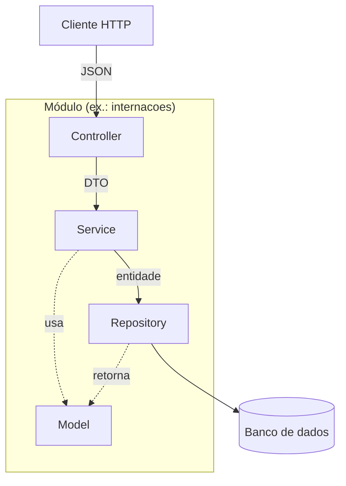

# Arquitetura

## Visão geral

O Vitalis é organizado em duas dimensões que se cruzam:

- **Horizontalmente, por domínio** — sete módulos, cada um dono de um pedaço do hospital
- **Verticalmente, por camada** — dentro de cada módulo, quatro camadas com responsabilidades fixas



## As camadas

| Camada | Responsabilidade | Não faz |
|---|---|---|
| **Controller** | Expor endpoints REST, validar o formato da entrada, traduzir para status HTTP | Regra de negócio, acesso a repositório |
| **Service** | Aplicar as regras, orquestrar módulos, controlar a transação, converter DTO ↔ entidade | Conhecer HTTP |
| **Repository** | Buscar e gravar dados, consultas derivadas | Decidir se a operação é permitida |
| **Model** | Estado e comportamento do domínio | Conhecer framework ou persistência |
| **DTO** | Contrato de entrada e saída da API | Ser a entidade |

### Por que o DTO existe

Expor a entidade direto na API acopla o contrato público ao formato interno: renomear um campo do domínio quebraria todos os clientes. O DTO é a fronteira — muda por motivo diferente do modelo.

## Direção das dependências

A seta aponta sempre para baixo e para dentro:

```
controller → service → repository → model
```

O `model` não conhece ninguém. É por isso que dá para testar `Quarto.ocupar()` ou `Atendimento.conflitaCom()` sem subir servidor, sem banco e sem mock.

## Fronteiras entre módulos

1. **O grafo de dependências é acíclico.** Se `consultas` depende de `pacientes`, `pacientes` nunca depende de `consultas`.
2. **Um módulo nunca acessa o repositório de outro.** `internacoes` não busca o quarto direto no banco — pede ao serviço de `quartos`.
3. **Cada regra de negócio tem um dono.** Está em um módulo e só nele.
4. **`comum` não depende de ninguém.** Se precisar de um domínio, não é comum.

Veja o mapa completo em [`modulos/README.md`](../modulos/README.md).

## Onde cada regra é aplicada

| Camada | Tipo de validação | Exemplo |
|---|---|---|
| **DTO / Controller** | Formato | CPF tem 11 dígitos, e-mail é um e-mail, campo obrigatório veio |
| **Service** | Regra de negócio | O profissional já tem atendimento nesse horário? |
| **Model** | Invariante do objeto | `Quarto.ocupar()` recusa se não há vaga |
| **Banco** | Integridade | Índice único em CPF, chave estrangeira, não-nulo |

As quatro se reforçam. A do banco é a última linha: mesmo que um bug passe pelas outras três, o dado não se corrompe.

## Tratamento de erros

Toda exceção do sistema herda de `HospitalException` e é traduzida em uma única resposta padrão por `GlobalExceptionHandler`. Nenhum controller escreve `try/catch` para montar resposta de erro — isso acontece em um lugar só.

| Exceção | HTTP |
|---|---|
| `RecursoNaoEncontradoException` | 404 |
| `RegraDeNegocioException` e derivadas | 409 |
| `AltaInvalidaException` | 422 |
| `DadosInvalidosException` | 400 |

Detalhamento em [diagrama-de-classes.md](diagrama-de-classes.md#3-hierarquia-de-exceções).

## Decisões registradas

As escolhas arquiteturais e seus motivos ficam em [`decisoes/`](decisoes) — um arquivo por decisão, com o contexto, as alternativas consideradas e as consequências aceitas.
