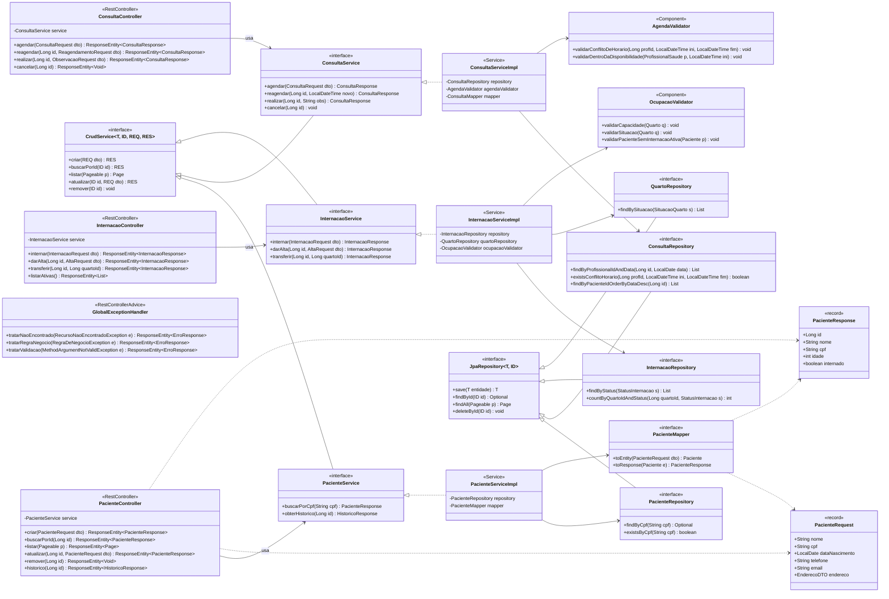
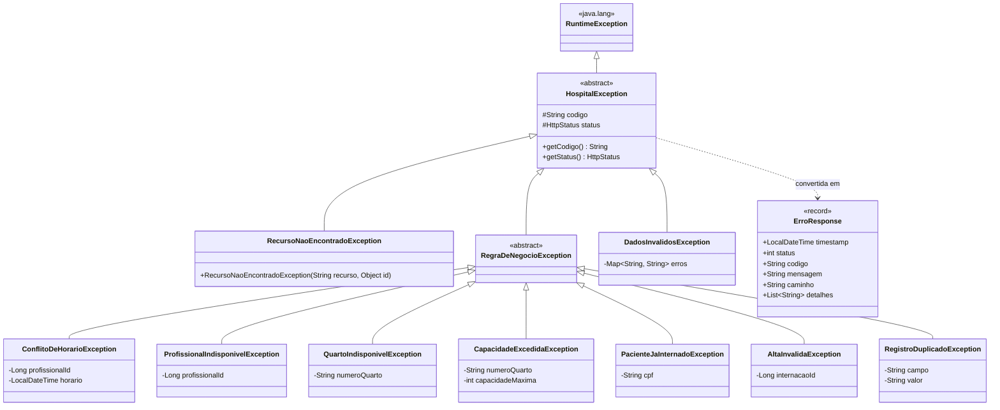

# Sistema de Informação Hospitalar — Diagrama de Classes

**PUC Minas — Bacharelado em Engenharia de Software — Programação Modular**
Trabalho Prático: Sistema Hospitalar

Este documento apresenta a modelagem orientada a objetos completa do sistema, dividida em três visões:

1. **Modelo de domínio** — entidades, atributos, comportamentos, heranças e associações
2. **Arquitetura em camadas** — Controller → Service → Repository → Model, DTOs e validadores
3. **Hierarquia de exceções** — tratamento de erros da API

---

## 1. Visão de Domínio (Model)

```mermaid
classDiagram
    direction TB

    %% ===================== ABSTRAÇÕES =====================
    class Pessoa {
        <<abstract>>
        #Long id
        #String nome
        #String telefone
        #String email
        #boolean ativo
        #LocalDateTime criadoEm
        +getIdentificacaoPrincipal() String
        +getTipo() String
        +validar() void
    }

    class Atendimento {
        <<abstract>>
        #Long id
        #Paciente paciente
        #ProfissionalSaude profissional
        #String observacoes
        #LocalDateTime criadoEm
        +getInicio() LocalDateTime
        +getFim() LocalDateTime
        +getResumo() String
        +conflitaCom(Atendimento outro) boolean
        +estaAtivo() boolean
    }

    %% ===================== ENTIDADES =====================
    class Paciente {
        -String cpf
        -LocalDate dataNascimento
        -Endereco endereco
        -List~Consulta~ consultas
        -List~Internacao~ internacoes
        +getIdade() int
        +estaInternado() boolean
        +adicionarConsulta(Consulta c) void
        +adicionarInternacao(Internacao i) void
        +getIdentificacaoPrincipal() String
    }

    class ProfissionalSaude {
        -String registroProfissional
        -Especialidade especialidade
        -List~Disponibilidade~ disponibilidades
        -List~Atendimento~ atendimentos
        +estaDisponivelEm(LocalDateTime ini, LocalDateTime fim) boolean
        +possuiConflito(Atendimento novo) boolean
        +getAgendaDoDia(LocalDate data) List~Atendimento~
        +getIdentificacaoPrincipal() String
    }

    class Endereco {
        <<value object>>
        -String logradouro
        -String numero
        -String complemento
        -String bairro
        -String cidade
        -UF uf
        -String cep
        +getEnderecoFormatado() String
    }

    class Consulta {
        -LocalDate data
        -LocalTime horario
        -int duracaoMinutos
        -String motivo
        -String observacoesMedicas
        -StatusConsulta status
        +agendar() void
        +reagendar(LocalDate d, LocalTime h) void
        +realizar(String observacoesMedicas) void
        +cancelar(String motivo) void
        +getInicio() LocalDateTime
        +getFim() LocalDateTime
    }

    class Internacao {
        -Quarto quarto
        -LocalDateTime dataEntrada
        -LocalDate dataPrevistaAlta
        -LocalDateTime dataEfetivaAlta
        -String motivo
        -StatusInternacao status
        +registrarAlta(LocalDateTime data, String obs) void
        +transferirPara(Quarto novo) void
        +getDiasInternado() long
        +estaAtiva() boolean
        +getInicio() LocalDateTime
        +getFim() LocalDateTime
    }

    class Quarto {
        -Long id
        -String numero
        -int andar
        -int capacidadeMaxima
        -TipoQuarto tipo
        -SituacaoQuarto situacao
        -List~Internacao~ internacoesAtivas
        +getOcupacaoAtual() int
        +getVagasDisponiveis() int
        +estaDisponivel() boolean
        +ocupar(Internacao i) void
        +liberar(Internacao i) void
        +atualizarSituacao() void
    }

    class Disponibilidade {
        -Long id
        -ProfissionalSaude profissional
        -DiaSemana diaSemana
        -LocalTime horaInicio
        -LocalTime horaFim
        -boolean ativo
        +cobre(LocalDateTime momento) boolean
        +sobrepoe(Disponibilidade outra) boolean
    }

    class RegistroClinico {
        -Long id
        -Atendimento atendimento
        -ProfissionalSaude autor
        -TipoRegistro tipo
        -String descricao
        -LocalDateTime dataRegistro
    }

    class HistoricoMedico {
        <<aggregate>>
        -Paciente paciente
        -List~Consulta~ consultas
        -List~Internacao~ internacoes
        -List~RegistroClinico~ registros
        +getTotalConsultas() int
        +getTotalInternacoes() int
        +getUltimoAtendimento() Atendimento
        +filtrarPorPeriodo(LocalDate ini, LocalDate fim) List~Atendimento~
    }

    %% ===================== ENUMERAÇÕES =====================
    class Especialidade {
        <<enumeration>>
        CLINICA_GERAL
        CARDIOLOGIA
        PEDIATRIA
        ORTOPEDIA
        GINECOLOGIA
        NEUROLOGIA
        ENFERMAGEM
        FISIOTERAPIA
    }

    class StatusConsulta {
        <<enumeration>>
        AGENDADA
        REALIZADA
        CANCELADA
        NAO_COMPARECEU
    }

    class StatusInternacao {
        <<enumeration>>
        ATIVA
        ALTA_CONCEDIDA
        TRANSFERIDA
        CANCELADA
    }

    class SituacaoQuarto {
        <<enumeration>>
        DISPONIVEL
        OCUPADO
        MANUTENCAO
        INTERDITADO
    }

    class TipoQuarto {
        <<enumeration>>
        ENFERMARIA
        APARTAMENTO
        UTI
        ISOLAMENTO
    }

    class DiaSemana {
        <<enumeration>>
        SEGUNDA
        TERCA
        QUARTA
        QUINTA
        SEXTA
        SABADO
        DOMINGO
    }

    class TipoRegistro {
        <<enumeration>>
        ANAMNESE
        DIAGNOSTICO
        PRESCRICAO
        EXAME
        EVOLUCAO
    }

    class UF {
        <<enumeration>>
        MG
        SP
        RJ
        ES
    }

    %% ===================== HERANÇA =====================
    Pessoa <|-- Paciente
    Pessoa <|-- ProfissionalSaude
    Atendimento <|-- Consulta
    Atendimento <|-- Internacao

    %% ===================== ASSOCIAÇÕES =====================
    Paciente "1" *-- "1" Endereco : possui
    Paciente "1" o-- "0..*" Consulta : realiza
    Paciente "1" o-- "0..*" Internacao : passa por
    ProfissionalSaude "1" o-- "0..*" Consulta : atende
    ProfissionalSaude "1" o-- "0..*" Internacao : e responsavel
    ProfissionalSaude "1" *-- "0..*" Disponibilidade : define
    Quarto "1" o-- "0..*" Internacao : aloja
    Atendimento "1" *-- "0..*" RegistroClinico : gera
    ProfissionalSaude "1" --> "0..*" RegistroClinico : registra
    HistoricoMedico "1" --> "1" Paciente : consolida
    HistoricoMedico "1" o-- "0..*" Consulta
    HistoricoMedico "1" o-- "0..*" Internacao
    HistoricoMedico "1" o-- "0..*" RegistroClinico

    %% ===================== DEPENDÊNCIAS DE ENUM =====================
    ProfissionalSaude ..> Especialidade
    Consulta ..> StatusConsulta
    Internacao ..> StatusInternacao
    Quarto ..> SituacaoQuarto
    Quarto ..> TipoQuarto
    Disponibilidade ..> DiaSemana
    RegistroClinico ..> TipoRegistro
    Endereco ..> UF
```



### 1.1 Decisões de modelagem

| Decisão | Justificativa |
|---|---|
| `Pessoa` abstrata (superclasse de `Paciente` e `ProfissionalSaude`) | Elimina duplicação de `nome`, `telefone`, `email` e permite polimorfismo em `getIdentificacaoPrincipal()` (CPF para paciente, registro profissional para o profissional). |
| `Atendimento` abstrata (superclasse de `Consulta` e `Internacao`) | A **regra 3** ("um profissional não pode ter dois atendimentos no mesmo horário") vale para consultas *e* internações. Tratar ambas como `Atendimento` permite validar conflito de agenda com um único algoritmo (`conflitaCom`), baseado em `getInicio()`/`getFim()`. Também simplifica o histórico médico. |
| `Endereco` como *value object* (composição) | Endereço não tem identidade própria nem existe sem o paciente — mapeado como `@Embeddable` (JPA) ou documento embutido (MongoDB). |
| `Disponibilidade` como classe separada | Atende ao requisito "controle de disponibilidade de atendimento". Permite que o profissional tenha várias janelas por dia da semana. |
| `RegistroClinico` | Atende ao item "informações relevantes registradas durante os atendimentos" do Histórico Médico, com tipagem (anamnese, diagnóstico, prescrição, exame, evolução). |
| `HistoricoMedico` como agregado de consulta (não persistido) | O histórico é **derivado** das consultas, internações e registros já persistidos. Montá-lo em memória evita duplicidade de dados e mantém a consistência automática (regra 6). |
| Enums em vez de `String` livre | Garante integridade de dados (`situacao` do quarto, `status` de consulta/internação) e evita valores inválidos. |
| `situacao` do quarto derivada da ocupação | `atualizarSituacao()` é chamado após `ocupar()`/`liberar()`, mantendo `SituacaoQuarto` coerente com `getOcupacaoAtual()` vs. `capacidadeMaxima` (regra 5). |

### 1.2 Multiplicidades

| Origem | Multiplicidade | Destino | Tipo | Regra de negócio |
|---|---|---|---|---|
| Paciente | 1 → 0..* | Consulta | Agregação | RN1, RN2 |
| Paciente | 1 → 0..* | Internacao | Agregação | RN1, RN4 |
| Paciente | 1 → 1 | Endereco | Composição | Req. 1 |
| ProfissionalSaude | 1 → 0..* | Consulta | Agregação | RN2, RN3 |
| ProfissionalSaude | 1 → 0..* | Internacao | Agregação | Req. 4, RN3 |
| ProfissionalSaude | 1 → 0..* | Disponibilidade | Composição | Escopo: disponibilidade |
| Quarto | 1 → 0..* | Internacao | Agregação | RN4, RN5 |
| Atendimento | 1 → 0..* | RegistroClinico | Composição | Req. 6 |
| HistoricoMedico | 1 → 1 | Paciente | Associação | RN6 |

### 1.3 Cobertura dos requisitos de atributos

| Requisito do enunciado | Classe | Atributos |
|---|---|---|
| 1. Paciente | `Paciente` + `Pessoa` + `Endereco` | `nome`, `cpf`, `dataNascimento`, `telefone`, `endereco`, `email` |
| 2. Profissional da Saúde | `ProfissionalSaude` + `Pessoa` | `nome`, `registroProfissional`, `especialidade`, `telefone`, `email` |
| 3. Consulta | `Consulta` + `Atendimento` | `paciente`, `profissional`, `data`, `horario`, `motivo`, `observacoesMedicas` |
| 4. Internação | `Internacao` + `Atendimento` | `paciente`, `profissional`, `quarto`, `dataEntrada`, `dataPrevistaAlta`, `dataEfetivaAlta`, `observacoes` |
| 5. Quarto | `Quarto` | `numero`, `andar`, `capacidadeMaxima`, `situacao` |
| 6. Histórico Médico | `HistoricoMedico` + `RegistroClinico` | `consultas`, `internacoes`, `registros` |

### 1.4 Onde cada regra de negócio é aplicada

| # | Regra | Onde é garantida |
|---|---|---|
| RN1 | Paciente com várias consultas/internações | Associações `Paciente → Consulta` e `Paciente → Internacao` (0..*) |
| RN2 | Consulta associada a paciente e profissional | Atributos obrigatórios (`@NotNull`) em `Atendimento` |
| RN3 | Profissional sem dois atendimentos no mesmo horário | `Atendimento.conflitaCom()` + `AgendaValidator.validarConflitoDeHorario()` + índice único no banco |
| RN4 | Internação com paciente e quarto disponível | `OcupacaoValidator.validarSituacao()` + `Quarto.estaDisponivel()` |
| RN5 | Quarto não ultrapassa capacidade máxima | `Quarto.ocupar()` + `OcupacaoValidator.validarCapacidade()` → `CapacidadeExcedidaException` |
| RN6 | Manter histórico | Status `REALIZADA`/`ALTA_CONCEDIDA` em vez de exclusão física; `HistoricoMedico` consolida |
| RN7 | Integridade e disponibilidade de recursos | Validadores na camada de serviço + transações (`@Transactional`) |

---

## 2. Visão de Arquitetura em Camadas



> O diagrama mostra a fatia completa de `Paciente`, `Consulta` e `Internacao`. As fatias de `ProfissionalSaude` e `Quarto` seguem exatamente o mesmo padrão (Controller → Service (interface) → ServiceImpl → Repository → Mapper/DTOs) e foram omitidas para manter a legibilidade.

### 2.1 Responsabilidade de cada camada

| Camada | Responsabilidade | O que **não** faz |
|---|---|---|
| **Controller** | Expor endpoints REST, validar formato de entrada (`@Valid`), converter para HTTP status | Não contém regra de negócio nem acessa repositório |
| **Service** | Regras de negócio (RN1–RN7), orquestração, transações, conversão DTO ↔ Entidade | Não conhece HTTP (`HttpServletRequest`, `ResponseEntity`) |
| **Repository** | Acesso a dados, consultas derivadas e `@Query` | Não contém regra de negócio |
| **Model** | Estado e comportamento do domínio (ex.: `Quarto.ocupar()`, `Consulta.cancelar()`) | Não conhece Spring nem persistência específica |
| **DTO/Mapper** | Contrato de entrada/saída da API, desacoplado do modelo | Não expõe entidades diretamente |

### 2.2 Estrutura de pacotes sugerida

```
br.pucminas.hospital
├── controller
│   ├── PacienteController.java
│   ├── ProfissionalController.java
│   ├── ConsultaController.java
│   ├── InternacaoController.java
│   ├── QuartoController.java
│   └── handler/GlobalExceptionHandler.java
├── service
│   ├── PacienteService.java          (interface)
│   ├── ConsultaService.java          (interface)
│   ├── impl/PacienteServiceImpl.java
│   ├── impl/ConsultaServiceImpl.java
│   └── validator/AgendaValidator.java
├── repository
│   ├── PacienteRepository.java
│   ├── ConsultaRepository.java
│   └── ...
├── model
│   ├── Pessoa.java                   (abstract)
│   ├── Paciente.java
│   ├── ProfissionalSaude.java
│   ├── Atendimento.java              (abstract)
│   ├── Consulta.java
│   ├── Internacao.java
│   ├── Quarto.java
│   ├── Endereco.java
│   ├── Disponibilidade.java
│   ├── RegistroClinico.java
│   └── enums/
├── dto
│   ├── request/
│   └── response/
├── mapper
└── exception
```

---

## 3. Hierarquia de Exceções



| Exceção | HTTP | Disparada quando |
|---|---|---|
| `RecursoNaoEncontradoException` | 404 | ID inexistente de paciente, profissional, quarto, consulta ou internação |
| `ConflitoDeHorarioException` | 409 | RN3 violada — profissional já tem atendimento no intervalo |
| `ProfissionalIndisponivelException` | 409 | Horário fora das janelas de `Disponibilidade` |
| `QuartoIndisponivelException` | 409 | RN4 — quarto em manutenção/interditado ou lotado |
| `CapacidadeExcedidaException` | 409 | RN5 — ocupação atingiria `capacidadeMaxima` |
| `PacienteJaInternadoException` | 409 | Paciente com internação `ATIVA` |
| `AltaInvalidaException` | 422 | Data de alta anterior à entrada, ou internação já encerrada |
| `RegistroDuplicadoException` | 409 | CPF, registro profissional ou número de quarto já cadastrado |
| `DadosInvalidosException` | 400 | Falha de validação de campos (Bean Validation) |

---

## 4. Arquivos deste diagrama

| Arquivo | Conteúdo |
|---|---|
| `docs/diagramas/01-dominio.mmd` | Diagrama de domínio (Mermaid) |
| `docs/diagramas/02-camadas.mmd` | Diagrama de camadas completo, com todas as fatias (Mermaid) |
| `docs/diagramas/03-excecoes.mmd` | Hierarquia de exceções (Mermaid) |
| `docs/diagramas/dominio.puml` | Diagrama de domínio em PlantUML (para exportar PNG/SVG na documentação) |
| `docs/diagramas/diagrama-classes.html` | **Versão visual renderizada** — abra no navegador: os três diagramas desenhados, com zoom e botão para baixar cada um em `.svg` |

Para renderizar o PlantUML:

```bash
java -jar plantuml.jar -tpng docs/diagramas/dominio.puml
```
