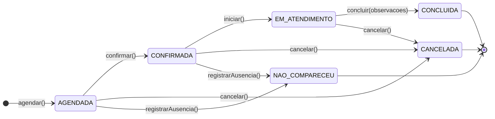
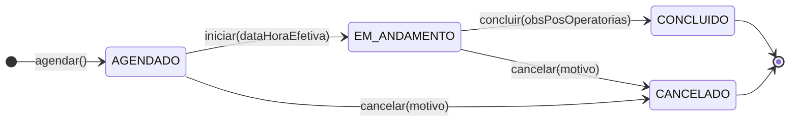

# Vitalis — Diagrama de Classes

**PUC Minas · Engenharia de Software · Programação Modular**
Sprint 2 — implementação integrada das issues #11, #12 e #13

Este documento descreve o modelo integrado após preservar a implementação de pacientes e consultas da `main` e integrar profissionais, quartos, internações e procedimentos cirúrgicos.

- [O que mudou desde a Sprint 1](#o-que-mudou-desde-a-sprint-1)
- [Modelo de domínio](#modelo-de-domínio)
- [Decisões de modelagem](#decisões-de-modelagem)
- [Máquinas de estado](#máquinas-de-estado)
- [Hierarquia de exceções](#hierarquia-de-exceções)
- [Rastreabilidade com o enunciado](#rastreabilidade-com-o-enunciado)

---

## Estado da implementação

A implementação de pacientes e consultas da `main` foi preservada e integrada
com as issues #11, #12 e #13. O código de consultas continua detalhado em
[Mermaid da Trilha B](diagramas/04-trilha-b.mmd), [PlantUML da Trilha B](diagramas/trilha-b.puml)
e [integração da Trilha B](integracao-trilha-b.md).

Características do modelo integrado:

- Atendimento usa parâmetros genéricos de Pessoa para manter comum independente
  dos cadastros. ConsultaAgendada concentra o intervalo apenas nas modalidades agendadas.
- `StatusConsulta` usa `EstadoTransicionavel`; procedimentos e internações também
  protegem suas transições no próprio modelo.
- Emergência confirma a presença na chegada, projetada como AGUARDANDO na API.
  Os seis estados internos e todas as transições da consulta são preservados.
- Transição inválida retorna **409**, conforme o aceite da issue #9; este PR altera
  o comportamento anterior de 422. Especialidade e disponibilidade usam
  CondicaoAtendimentoException com códigos próprios e 409.
- Os módulos de profissionais, quartos, internações e procedimentos cirúrgicos
  estão integrados. Consultas e procedimentos compartilham a agenda; internações
  mantêm referências tipadas ao paciente e profissional e não ocupam agenda horária.

As [ADRs 0006](decisoes/0006-base-compartilhada-de-atendimentos.md) e
[0007](decisoes/0007-adaptador-temporario-de-consultas.md) registram essas escolhas.

## O que mudou desde a Sprint 1

| Sprint 1 | Sprint 2 |
|---|---|
| `ProfissionalSaude` concreta, com um campo `especialidade` | `ProfissionalSaude` **abstrata** → `ClinicoGeral`, `Especialista`, `Cirurgiao` |
| `Atendimento` → `Consulta`, `Internacao` | `Atendimento` → `Consulta` (abstrata), `ProcedimentoCirurgico`, `Internacao` |
| — | `Consulta` → `ConsultaRotina`, `ConsultaEspecializada`, `AtendimentoEmergencia` |
| `StatusConsulta` com 4 valores, sem regra de transição | 6 estados com máquina de transições |
| — | `EstadoTransicionavel<E>`, `PrioridadeEmergencia`, `StatusProcedimento`, `Encaminhamento` |
| `HistoricoMedico` com listas separadas por tipo | lista única de `Atendimento`, polimórfica |

---

## Modelo de domínio

```mermaid
classDiagram
    direction TB

    class Pessoa {
        <<abstract>>
        #Long id
        #String nome
        #String telefone
        #String email
        #boolean ativo
        +getIdentificacaoPrincipal() String
        +getTipo() String
    }

    class ProfissionalSaude {
        <<abstract>>
        #String registroProfissional
        #List~Disponibilidade~ disponibilidades
        +estaDisponivelEm(LocalDateTime ini, LocalDateTime fim) boolean
        +getIdentificacaoPrincipal() String
    }

    class ClinicoGeral {
        +encaminhar(Paciente p, Especialidade e, String motivo) Encaminhamento
    }

    class Especialista {
        -Especialidade especialidade
        +atendeNaEspecialidade(Especialidade e) boolean
    }

    class Cirurgiao {
        -String areaCirurgica
    }

    class Paciente {
        -String cpf
        -LocalDate dataNascimento
        -Endereco endereco
        +getIdade() int
    }

    class Encaminhamento {
        -ClinicoGeral origem
        -Paciente paciente
        -Especialidade especialidadeDestino
        -String motivo
        -boolean atendido
    }

    class Atendimento {
        <<abstract>>
        #Long id
        #P extends Pessoa paciente
        #R extends Pessoa profissional
        #LocalDateTime criadoEm
        #String observacoes
        +getInicio() LocalDateTime
        +getFim() LocalDateTime
        +validarCondicoes() void
        +conflitaCom(Atendimento outro) boolean
        +ocupaAgenda() boolean
    }

    class Consulta {
        <<abstract>>
        #LocalDate data
        #LocalTime horario
        #int duracaoMinutos
        #String motivo
        #String observacoesMedicas
        #StatusConsulta status
        +confirmar() void
        +iniciar() void
        +concluir(String obs) void
        +cancelar(String motivo) void
        +registrarAusencia() void
    }

    class ConsultaRotina {
        +validarCondicoes() void
    }

    class ConsultaEspecializada {
        -Especialidade especialidade
        +validarCondicoes() void
    }

    class AtendimentoEmergencia {
        -PrioridadeEmergencia prioridade
        -LocalDateTime chegadaEm
        +validarCondicoes() void
        +aguardaAvaliacao() boolean
        +ocupaAgenda() boolean
    }

    class ProcedimentoCirurgico {
        -String descricao
        -String tipoCirurgia
        -String observacoesPreOperatorias
        -String observacoesPosOperatorias
        -LocalDateTime dataHoraPrevista
        -LocalDateTime dataHoraEfetiva
        -StatusProcedimento status
        +iniciar(LocalDateTime inicio) void
        +concluir(String obsPos) void
        +cancelar(String motivo) void
        +validarCondicoes() void
    }

    class Internacao {
        -Long quartoId
        -LocalDateTime dataEntrada
        -LocalDate dataPrevistaAlta
        -LocalDateTime dataEfetivaAlta
        -String motivo
        -StatusInternacao status
        +registrarAlta(LocalDateTime d) void
        +registrarTransferencia(LocalDateTime d) void
        +validarCondicoes() void
    }

    class Quarto {
        -String numero
        -int andar
        -int capacidadeMaxima
        -TipoQuarto tipo
        -SituacaoQuarto situacao
        +getOcupacaoAtual() int
        +estaDisponivel() boolean
        +ocupar(Long internacaoId) void
        +liberar(Long internacaoId) void
    }

    class EstadoTransicionavel~E~ {
        <<interface>>
        +permite(E destino) boolean
    }

    class StatusConsulta {
        <<enumeration>>
        AGENDADA
        CONFIRMADA
        EM_ATENDIMENTO
        CONCLUIDA
        CANCELADA
        NAO_COMPARECEU
    }

    class PrioridadeEmergencia {
        <<enumeration>>
        BAIXA
        MODERADA
        ALTA
        CRITICA
    }

    class StatusProcedimento {
        <<enumeration>>
        AGENDADO
        EM_ANDAMENTO
        CONCLUIDO
        CANCELADO
    }

    class SituacaoQuarto {
        <<enumeration>>
        DISPONIVEL
        OCUPADO
        MANUTENCAO
        INTERDITADO
    }

    class TipoQuarto {
        <<enumeration>>
        ENFERMARIA
        APARTAMENTO
        UTI
        ISOLAMENTO
    }

    class StatusInternacao {
        <<enumeration>>
        ATIVA
        ALTA_CONCEDIDA
        TRANSFERIDA
        CANCELADA
    }

    class Especialidade {
        <<enumeration>>
        CLINICA_GERAL
        CARDIOLOGIA
        PEDIATRIA
        ORTOPEDIA
        GINECOLOGIA
        NEUROLOGIA
        ENFERMAGEM
        FISIOTERAPIA
    }

    Pessoa <|-- Paciente
    Pessoa <|-- ProfissionalSaude
    ProfissionalSaude <|-- ClinicoGeral
    ProfissionalSaude <|-- Especialista
    ProfissionalSaude <|-- Cirurgiao
    Atendimento <|-- Consulta
    Atendimento <|-- ProcedimentoCirurgico
    Atendimento <|-- Internacao
    Consulta <|-- ConsultaRotina
    Consulta <|-- ConsultaEspecializada
    Consulta <|-- AtendimentoEmergencia

    EstadoTransicionavel <|.. StatusConsulta

    Paciente "1" o-- "0..*" Atendimento : recebe
    ProfissionalSaude "1" o-- "0..*" Atendimento : realiza
    ProfissionalSaude "1" *-- "0..*" Disponibilidade : define
    Paciente "1" *-- "1" Endereco : possui
    ClinicoGeral "1" o-- "0..*" Encaminhamento : emite
    Cirurgiao "1" o-- "0..*" ProcedimentoCirurgico : executa
    Quarto "1" o-- "0..*" Internacao : aloja

    %% ===================== DEPENDÊNCIAS DE ENUM =====================
    Especialista ..> Especialidade
    ConsultaEspecializada ..> Especialidade
    Consulta ..> StatusConsulta
    Internacao ..> StatusInternacao
    ProcedimentoCirurgico ..> StatusProcedimento
    Quarto ..> SituacaoQuarto
    Quarto ..> TipoQuarto
    Disponibilidade ..> DiaSemana
    AtendimentoEmergencia ..> PrioridadeEmergencia
    Endereco ..> UF
```

> O diagrama acima omite `Endereco`, `Disponibilidade`, `RegistroClinico`, `HistoricoMedico` e as enumerações herdadas da Sprint 1, para caber na tela. A versão completa está em [`diagramas/01-dominio.mmd`](diagramas/01-dominio.mmd).

---

## Decisões de modelagem

### 1. `Consulta` abstrata entre `Atendimento` e as três modalidades

As três modalidades de consulta compartilham `data`, `horario`, `duracaoMinutos`, `motivo`, `observacoesMedicas` e — o que mais importa — **a máquina de seis estados**. Sem a abstrata no meio, essa máquina seria escrita três vezes.

É exatamente o que o enunciado proíbe:

> *"O sistema deverá representar essas características sem duplicar desnecessariamente os atributos e comportamentos comuns."*

**O incômodo:** um atendimento de emergência não é agendado — o paciente chega. Colocá-lo sob `Consulta` faz ele herdar `data` e `horario`, que nele significam *quando aconteceu*, não *quando foi marcado*.

Aceitamos esse incômodo porque a alternativa — emergência herdando direto de `Atendimento` — duplicaria status, observações e a máquina de estados inteira. `AtendimentoEmergencia` sobrescreve `ocupaAgenda()` devolvendo `false`, e é assim que ele escapa da verificação de conflito de horário.

> **Ponto aberto para o grupo.** Se o Enzo ou o Armando discordarem, a hora de dizer é antes de a #8 começar.

### 2. `validarCondicoes()` é abstrato em `Atendimento`

É o método que o enunciado cobra nominalmente:

> *"Cada modalidade deverá implementar sua própria lógica de validação das condições necessárias para a realização do atendimento."*

| Modalidade | O que valida |
|---|---|
| `ConsultaRotina` | Profissional livre no horário e dentro da disponibilidade |
| `ConsultaEspecializada` | Tudo da rotina **mais** especialidade compatível |
| `AtendimentoEmergencia` | Nada de agenda — é imediato por natureza |
| `ProcedimentoCirurgico` | Responsável é `Cirurgiao`; ciclo de vida impede conclusão sem início |
| `Internacao` | Quarto disponível, com vaga, e paciente sem internação ativa |

### 3. Transições protegidas no domínio

`StatusConsulta` implementa `EstadoTransicionavel` e usa `Transicoes` para
validar as mudanças. Procedimentos e internações protegem suas transições nos
próprios métodos de domínio; uma tentativa inválida lança
`TransicaoInvalidaException`.

### 4. `Encaminhamento` como entidade

> *"Pode encaminhar pacientes para atendimento especializado."*

Encaminhar não é só chamar um método e esquecer — é um registro que alguém precisa consultar depois para marcar a consulta especializada. Vira entidade, com origem, paciente, especialidade de destino, motivo e se já foi atendido.

---

## Máquinas de estado

### Situação da consulta

```mermaid
stateDiagram-v2
    direction LR
    [*] --> AGENDADA : agendar()
    AGENDADA --> CONFIRMADA : confirmar()
    AGENDADA --> CANCELADA : cancelar()
    AGENDADA --> NAO_COMPARECEU : registrarAusencia()
    CONFIRMADA --> EM_ATENDIMENTO : iniciar()
    CONFIRMADA --> CANCELADA : cancelar()
    CONFIRMADA --> NAO_COMPARECEU : registrarAusencia()
    EM_ATENDIMENTO --> CONCLUIDA : concluir(observacoes)
    EM_ATENDIMENTO --> CANCELADA : cancelar()
    CONCLUIDA --> [*]
    CANCELADA --> [*]
    NAO_COMPARECEU --> [*]
```

As transições que o enunciado proíbe nominalmente:

> *"Uma consulta já concluída não deverá voltar a ser considerada agendada. Da mesma forma, uma consulta cancelada não deverá ser registrada como concluída sem que exista um novo agendamento."*

Ambas caem na regra geral: **`CONCLUIDA`, `CANCELADA` e `NAO_COMPARECEU` são estados finais.** Para reatender o paciente, agenda-se uma consulta nova.

> **Ponto aberto para o grupo.** O enunciado dá exemplos, não a tabela fechada. Esta tabela é uma proposta — confirmem antes de a #9 começar.

### Ciclo do procedimento cirúrgico

```mermaid
stateDiagram-v2
    direction LR
    [*] --> AGENDADO : agendar()
    AGENDADO --> EM_ANDAMENTO : iniciar(dataHoraEfetiva)
    AGENDADO --> CANCELADO : cancelar(motivo)
    EM_ANDAMENTO --> CONCLUIDO : concluir(obsPosOperatorias)
    EM_ANDAMENTO --> CANCELADO : cancelar(motivo)
    CONCLUIDO --> [*]
    CANCELADO --> [*]
```

**Não existe seta de `AGENDADO` para `CONCLUIDO`.** É a invariante do enunciado:

> *"Não será permitido registrar um procedimento como concluído se ele não tiver sido iniciado."*

Isso é invariante do objeto, não validação de tela: `concluir()` recusa quando o estado não é `EM_ANDAMENTO`, mesmo que o controller esqueça de checar. É também `iniciar()` quem grava a `dataHoraEfetiva` — sem ela, não há o que concluir.

---

## Hierarquia de exceções

Fonte completa em [`diagramas/03-excecoes.mmd`](diagramas/03-excecoes.mmd).

### Implementadas — `modulos/comum/service/` ([#5](https://github.com/GustavoAlbuquerquee/vitalis/issues/5))

| Exceção | HTTP | Código | Quando |
|---|---|---|---|
| `RecursoNaoEncontradoException` | 404 | `RECURSO_NAO_ENCONTRADO` | ID inexistente |
| `DadosInvalidosException` | 400 | `DADOS_INVALIDOS` | Falha de validação de campo |
| `ConflitoDeHorarioException` | 409 | `CONFLITO_DE_HORARIO` | RN3 — profissional já ocupado no intervalo |
| `QuartoIndisponivelException` | 409 | `QUARTO_INDISPONIVEL` | RN4 — quarto em manutenção ou interditado |
| `CapacidadeExcedidaException` | 409 | `CAPACIDADE_EXCEDIDA` | RN5 — quarto lotado |
| `PacienteJaInternadoException` | 409 | `PACIENTE_JA_INTERNADO` | Paciente com internação ativa |
| `TransicaoInvalidaException` | **409** | `TRANSICAO_INVALIDA` | Transição de estado proibida, em qualquer entidade |

`RegraDeNegocioException` é abstrata e define 409 como padrão. `TransicaoInvalidaException` também retorna 409, conforme o critério de aceite da issue #9.

### Previstas pelo modelo, ainda não implementadas

Nascem das regras que as trilhas B e C ainda vão escrever:

| Exceção | HTTP | Quando | Issue |
|---|---|---|---|
| `EspecialidadeIncompativelException` | 409 | Consulta especializada com profissional de outra área | [#8](https://github.com/GustavoAlbuquerquee/vitalis/issues/8) |
| `CirurgiaoNaoHabilitadoException` | 409 | Cirurgião sem habilitação para o tipo de cirurgia | [#13](https://github.com/GustavoAlbuquerquee/vitalis/issues/13) |
| `AltaInvalidaException` | 422 | Alta anterior à entrada, ou internação já encerrada | [#12](https://github.com/GustavoAlbuquerquee/vitalis/issues/12) |
| `ProfissionalIndisponivelException` | 409 | Horário fora das janelas de disponibilidade | [#8](https://github.com/GustavoAlbuquerquee/vitalis/issues/8) |
| `RegistroDuplicadoException` | 409 | CPF ou registro profissional já cadastrado | [#7](https://github.com/GustavoAlbuquerquee/vitalis/issues/7) · [#11](https://github.com/GustavoAlbuquerquee/vitalis/issues/11) |

---

## Rastreabilidade com o enunciado

| O enunciado pede | Onde está no modelo |
|---|---|
| Médico clínico geral com encaminhamento | `ClinicoGeral` + `Encaminhamento` |
| Especialista com área de atuação e busca por área | `Especialista.especialidade` + `GET /profissionais?especialidade=` |
| Cirurgião com registro de procedimentos | `GET /profissionais/{id}/procedimentos-cirurgicos` |
| Consulta de rotina | `ConsultaRotina` |
| Consulta especializada com profissional compatível | `ConsultaEspecializada.validarCondicoes()` |
| Emergência com prioridade e fila | `AtendimentoEmergencia` + `PrioridadeEmergencia` |
| Procedimento com pré e pós-operatório, previsto e efetivo | `ProcedimentoCirurgico` |
| Sem duplicar atributos e comportamentos comuns | `Pessoa`, `ProfissionalSaude`, `Atendimento`, `Consulta` abstratas |
| Cada modalidade valida suas condições | `validarCondicoes()` abstrato, sobrescrito em 5 classes |
| Seis situações da consulta | `StatusConsulta` + máquina de transições |
| Impedir alterações incompatíveis | `EstadoTransicionavel` + `TransicaoInvalidaException` |
| Sem valores textuais livres | 11 enumerações, nenhuma `String` de estado |
| Procedimento não conclui sem iniciar | Ausência da transição `AGENDADO → CONCLUIDO` |
| Tipos de quarto | `TipoQuarto` + `Quarto` — classificação informativa, sem restrições adicionais de ocupação (ADR 0008) |

---

## Arquivos

| Arquivo | Conteúdo |
|---|---|
| [`diagramas/01-dominio.mmd`](diagramas/01-dominio.mmd) | Domínio completo |
| [`diagramas/02-camadas.mmd`](diagramas/02-camadas.mmd) | Arquitetura em camadas |
| [`diagramas/03-excecoes.mmd`](diagramas/03-excecoes.mmd) | Hierarquia de exceções |
| [`diagramas/04-estados-consulta.mmd`](diagramas/04-estados-consulta.mmd) | Máquina de estados da consulta |
| [`diagramas/05-estados-procedimento.mmd`](diagramas/05-estados-procedimento.mmd) | Ciclo do procedimento cirúrgico |
| [`diagramas/dominio.puml`](diagramas/dominio.puml) | Domínio em PlantUML |
| [`diagramas/diagrama-classes.html`](diagramas/diagrama-classes.html) | Versão renderizada, com zoom e download em `.svg` |
