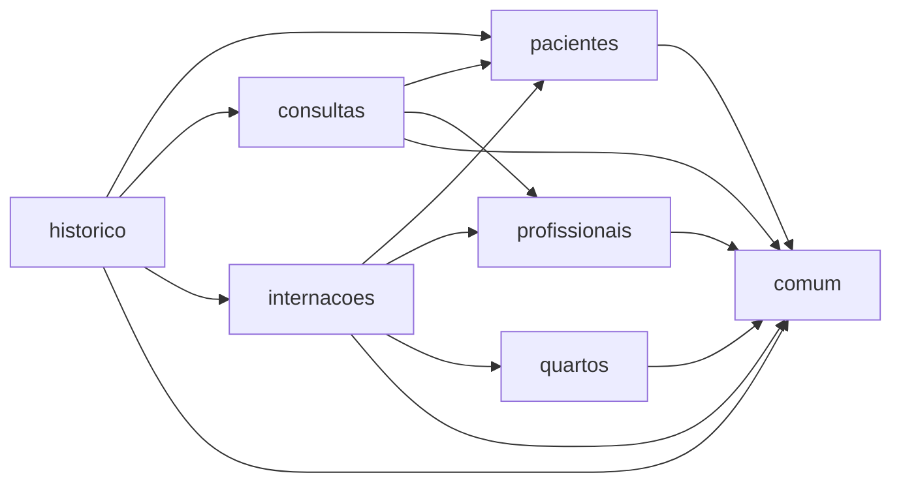

# Módulos

O Vitalis é dividido por **domínio**, não por tipo de arquivo. Cada diretório aqui é dono de um pedaço do hospital e carrega suas próprias camadas.

## Mapa de dependências



| Módulo | Responsabilidade | Pode depender de |
|---|---|---|
| [`comum`](comum) | Exceções, respostas de erro, validações e tipos compartilhados | — |
| [`pacientes`](pacientes) | Cadastro de pacientes | `comum` |
| [`profissionais`](profissionais) | Cadastro de profissionais e disponibilidade | `comum` |
| [`quartos`](quartos) | Leitos, capacidade e ocupação | `comum` |
| [`consultas`](consultas) | Agendamento e ciclo de vida das consultas | `pacientes`, `profissionais`, `comum` |
| [`internacoes`](internacoes) | Entrada, transferência e alta | `pacientes`, `profissionais`, `quartos`, `comum` |
| [`historico`](historico) | Consolidação do histórico médico | `pacientes`, `consultas`, `internacoes`, `comum` |

## As quatro regras de fronteira

1. **O grafo de dependências é acíclico.** Se um módulo precisa "voltar" para quem depende dele, a lógica está no lugar errado.
2. **Um módulo nunca acessa o repositório de outro.** A conversa entre módulos acontece pela camada de serviço.
3. **Cada regra de negócio mora em um único módulo** — o dono da regra é quem aparece na coluna "Onde vive" de [docs/regras-de-negocio.md](../docs/regras-de-negocio.md).
4. **`comum` não depende de ninguém.** Se algo em `comum` precisa conhecer `pacientes`, aquilo não é comum.

## Estrutura interna de um módulo

```
<modulo>/
├── controller/     expõe a API REST — recebe, valida formato, devolve status
├── service/        aplica as regras de negócio e controla a transação
├── repository/     busca e grava dados
├── model/          entidades e enumerações do domínio
└── dto/            contratos de entrada e saída da API
```

A direção da dependência é sempre a mesma: `controller → service → repository → model`. Nunca o contrário.
