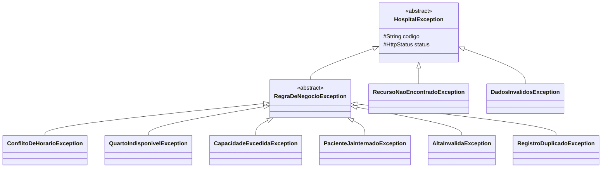

# Módulo `comum`

Tudo que mais de um módulo precisa e que não pertence a nenhum domínio específico.

## Responsabilidade

Fornecer a base compartilhada: hierarquia de exceções, formato padrão de resposta de erro, validações reutilizáveis e tipos de apoio.

## O que mora aqui

| Item | Papel |
|---|---|
| `HospitalException` | Raiz de todas as exceções do sistema — carrega código e status HTTP |
| `RegraDeNegocioException` | Base das violações de regra (RN1–RN7) |
| `RecursoNaoEncontradoException` | ID inexistente em qualquer módulo |
| `DadosInvalidosException` | Falha de validação de campos |
| `ErroResponse` | Formato único de erro devolvido pela API |
| `GlobalExceptionHandler` | Converte exceção em resposta HTTP, em um só lugar |
| `Endereco` | Objeto de valor reutilizável |
| `UF` | Enumeração das unidades federativas |

## Hierarquia de exceções

## Dependências

**Nenhuma.** Este módulo não conhece nenhum outro.

> Se algo aqui precisar importar `pacientes`, `consultas` ou qualquer outro módulo, aquilo não é comum — é do domínio que está tentando puxá-lo para cá.

## O que **não** pertence aqui

- Regra de negócio de um domínio específico
- Entidade que só um módulo usa
- Utilitário criado "porque um dia alguém vai precisar"
