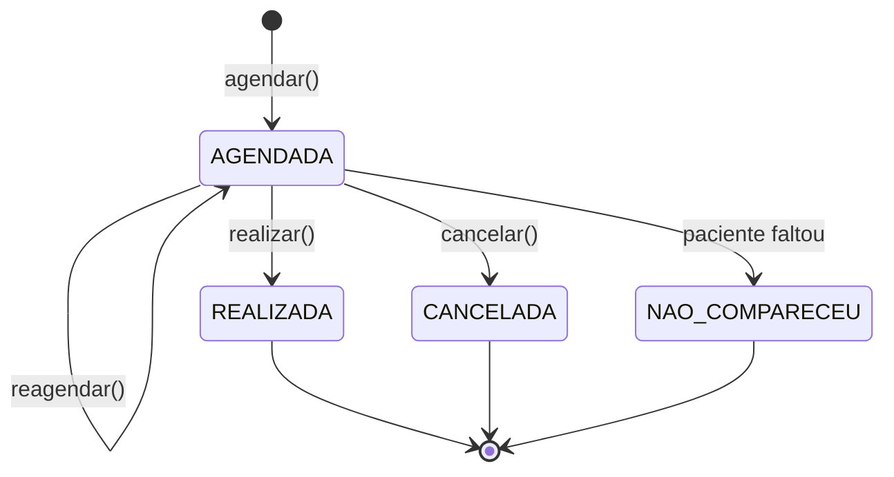

# Módulo `consultas`

O atendimento ambulatorial — o paciente vem, é atendido e vai embora.

## Responsabilidade

Todo o ciclo de vida de uma consulta: agendar, reagendar, realizar, cancelar. É aqui que mora a verificação de conflito de agenda, a regra mais sensível do sistema.

## Entidades

| Entidade | Atributos principais |
|---|---|
| `Consulta` (herda de `Atendimento`) | `data`, `horario`, `duracaoMinutos`, `motivo`, `observacoesMedicas`, `status` |
| `Atendimento` *(abstrata)* | `paciente`, `profissional`, `observacoes` |
| `StatusConsulta` *(enumeração)* | `AGENDADA`, `REALIZADA`, `CANCELADA`, `NAO_COMPARECEU` |

## Ciclo de vida



Note que **nenhuma transição apaga a consulta**. Cancelar é mudar o status, não excluir o registro — é assim que a **RN6** se sustenta.

## Regras que este módulo garante

| # | Regra | Como |
|---|---|---|
| **RN2** | Toda consulta tem paciente e profissional | Campos obrigatórios em `Atendimento` |
| **RN3** | Um profissional não pode ter dois atendimentos no mesmo horário | `AgendaValidator` compara o intervalo com consultas **e** internações já marcadas |
| — | O horário precisa estar dentro de uma janela de disponibilidade | Pergunta ao módulo [`profissionais`](../profissionais) |
| — | Não se agenda consulta no passado | Validação na camada de serviço |
| **RN6** | A consulta realizada permanece no histórico | Status em vez de exclusão |

### Sobre a RN3

O algoritmo é um só, e vem da classe abstrata `Atendimento`:

```
conflitaCom(outro) = this.getInicio() < outro.getFim()
                  && outro.getInicio() < this.getFim()
```

Como `Consulta` e `Internacao` são ambas `Atendimento`, a mesma comparação cobre os dois casos. Sem isso, seriam duas implementações — e duas chances de divergir.

## Endpoints previstos

| Método | Rota | O que faz |
|---|---|---|
| `POST` | `/consultas` | Agenda uma consulta |
| `GET` | `/consultas/{id}` | Busca por identificador |
| `GET` | `/consultas?profissionalId=&data=` | Lista com filtros |
| `PATCH` | `/consultas/{id}/reagendamento` | Move para outra data e horário |
| `PATCH` | `/consultas/{id}/realizacao` | Registra a realização e as observações médicas |
| `DELETE` | `/consultas/{id}` | Cancela |

## Dependências

`pacientes` · `profissionais` · `comum`

## O que **não** pertence aqui

- Internar o paciente após a consulta — é do módulo [`internacoes`](../internacoes)
- Listar o histórico completo — é do módulo [`historico`](../historico)
