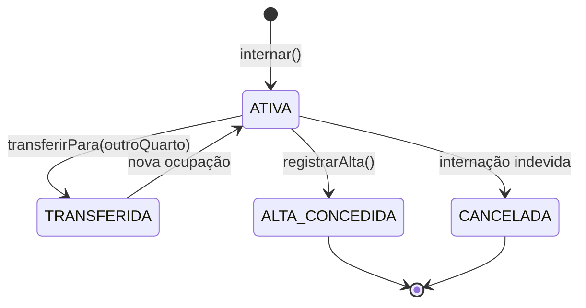

# Módulo `internacoes`

O paciente que fica.

## Responsabilidade

Controlar a permanência do paciente no hospital: entrada, transferência entre quartos e alta. É o módulo que mais conversa com os outros — precisa de paciente, profissional responsável e quarto com vaga.

## Entidades

| Entidade | Atributos principais |
|---|---|
| `Internacao` (herda de `Atendimento`) | `quarto`, `dataEntrada`, `dataPrevistaAlta`, `dataEfetivaAlta`, `motivo`, `status` |
| `StatusInternacao` *(enumeração)* | `ATIVA`, `ALTA_CONCEDIDA`, `TRANSFERIDA`, `CANCELADA` |

## Ciclo de vida

## Regras que este módulo garante

| # | Regra | Como |
|---|---|---|
| **RN4** | Toda internação tem paciente e quarto disponível | `OcupacaoValidator.validarSituacao()` antes de gravar |
| **RN5** | O quarto não ultrapassa a capacidade máxima | Pergunta ao módulo [`quartos`](../quartos) e chama `Quarto.ocupar()` |
| **RN3** | O profissional responsável não pode ter conflito de horário | Mesmo `conflitaCom()` herdado de `Atendimento` |
| — | Um paciente não pode ter duas internações ativas ao mesmo tempo | `validarPacienteSemInternacaoAtiva()` |
| — | A data efetiva de alta nunca é anterior à data de entrada | `AltaInvalidaException` |
| **RN6** | A internação encerrada permanece no histórico | Status `ALTA_CONCEDIDA` em vez de exclusão |

### A transação da internação

Internar não é gravar um registro — são três coisas que precisam acontecer juntas ou nenhuma:

1. A internação é criada com status `ATIVA`
2. O quarto registra a ocupação
3. A situação do quarto é recalculada (`DISPONIVEL` → `OCUPADO` se lotou)

Se qualquer passo falhar, tudo volta atrás. Por isso a operação vive na camada de serviço, sob transação — não no controller.

## Endpoints previstos

| Método | Rota | O que faz |
|---|---|---|
| `POST` | `/internacoes` | Interna um paciente |
| `GET` | `/internacoes/{id}` | Busca por identificador |
| `GET` | `/internacoes?status=ATIVA` | Lista, tipicamente as ativas |
| `PATCH` | `/internacoes/{id}/alta` | Registra a alta e libera o leito |
| `PATCH` | `/internacoes/{id}/transferencia` | Move o paciente para outro quarto |

## Dependências

`pacientes` · `profissionais` · `quartos` · `comum`

## O que **não** pertence aqui

- Decidir se um quarto está disponível — quem responde isso é o módulo [`quartos`](../quartos)
- Consolidar o histórico do paciente — é do módulo [`historico`](../historico)
